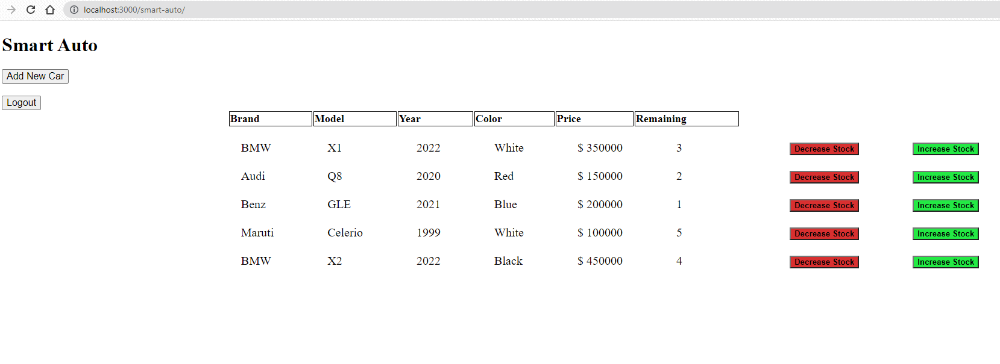
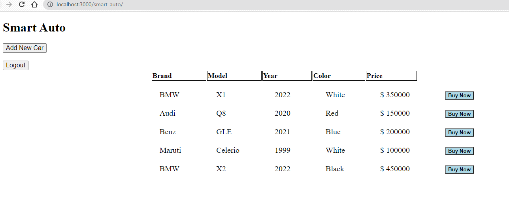

# Car Inventory and Sales Management System

## Assumptions
    - Both UI and Backend are to be implemented
    - ADMIN has the ability to add or remove cars from the inventory - This specifies the ability to immediately increment/decrement the 
        count of the specific car by click of a button
    - ADMIN also has the ability to add a new type of car to the inventory
    - BUYER can only view available cars and buy them

## Login Credentials
    - ADMIN
        - username: admin 
        - password: admin

    - BUYER
        - username: user1
        - password: pass

        - username: user2
        - password: pass

        - username: user3
        - password: pass

## Run Application
    - Start spring boot
    - Hit in browser http://localhost:3000/smart-auto
    - H2 console http://localhost:3000/smart-auto/h2-console

## Stack
    - Front end --> Javascript, HTML, CSS
    - Back end  --> Java, Spring Boot

## Snapshots

- Admin Home Page

- Buyer Home Page   
